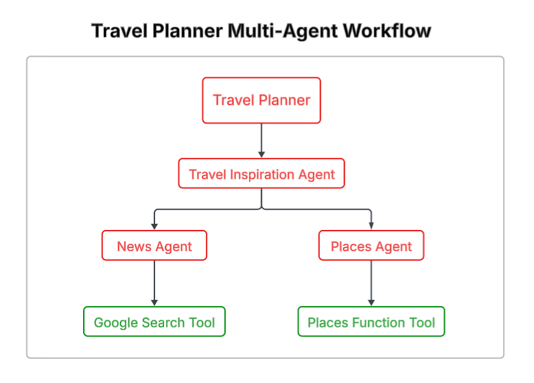

## 🧠 Agentic Workflow

<p align="center">
  
</p>

# 🌍 Travel Planner Application

The **Travel Planner Application** is an AI-powered system designed to help users plan trips intelligently by generating personalized travel itineraries, destination recommendations, and activity plans.

This project is built using **Google ADK (Agent Development Kit)** and follows an **agentic architecture**, enabling modular, scalable, and intelligent decision-making through AI agents.

---

## 📌 Overview

The **Travel Planner Application** leverages **Agentic AI** to automate and enhance the travel planning process. Instead of a single monolithic AI response, the system uses multiple agents to reason, plan, and generate structured travel outputs.

Using **Google ADK**, the application orchestrates AI agents responsible for:
- Understanding user intent
- Planning destinations
- Designing itineraries
- Producing final structured travel plans

This makes the system flexible, extensible, and closer to real-world AI applications.

---

## 🧠 Agentic Architecture (Google ADK)

This project is developed using **Google Agent Development Kit (ADK)**, which enables:

- 🧩 Modular AI agents
- 🧠 Structured reasoning and planning
- 🔁 Agent orchestration workflows
- 📈 Scalable agent-based design

### Example Agent Roles:
- **Main Agent** – Understand the user intent 
- **Manager Agent** – Oversees the planning workflow  
- **News Agent** – Provide the news about user location   
- **Places Agent** – Provide the place distance details e:g, hotel, ground etc. 

This architecture ensures clean separation of responsibilities and easy future expansion.

---

## ✨ Features

- ✅ Personalized travel planning using AI
- ✅ Agent-based itinerary generation
- ✅ Structured and readable travel outputs
- ✅ Secure handling of API keys
- ✅ Modular and extensible architecture
- ✅ Built for future integration with travel APIs

---

## 🛠️ Tech Stack

| Technology | Purpose |
|---------|--------|
| **Python** | Core backend logic |
| **Google ADK** | Agent orchestration & agent lifecycle |
| **Gemini API** | Natural language reasoning & planning |
| **Git & GitHub** | Version control |
| **dotenv (.env)** | Secure environment variable management |

---

## ⚙️ Installation

### 1️⃣ Clone the Repository
```bash
git clone https://github.com/M-Abdullah-Jutt/Travel-Planner-Application.git
cd Travel-Planner-Application

---

## 🤝 Contributing

To Contribute

### Fork the Repo.
### Commit your changes
### Push the branch
### Open a Pull Request
